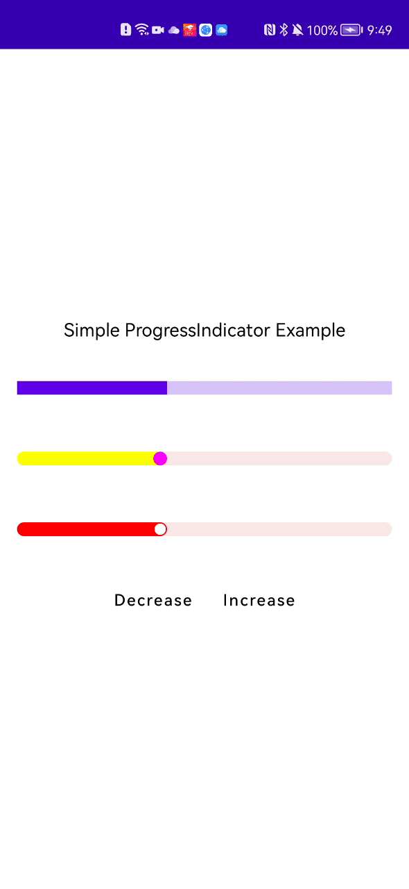

# compose-progressIndicator
This Library is designed to improve the [LinearProgressIndicator](https://foso.github.io/Jetpack-Compose-Playground/material/linearprogressindicator/) provided by Jetpack Compose. Beside the base functionality provided by LinearProgressIndicator, This library supports the round corners for progressbar, thumb at the end of the bar, and the animations when progress changed. Developers can customize the size, postion, and the color of the thumb.



# Usage
All functionalities mentioned above are implemented in one component: [SimpleProgressIndicatorWithAnim](https://github.com/KevinnZou/compose-progressIndicator/blob/main/progressindicator/src/main/java/com/kevinnzou/compose/progressindicator/SimpleProgressIndicator.kt)
```kotlin
@Composable
fun SimpleProgressIndicatorWithAnim(
    modifier: Modifier = Modifier,
    progress: Float = 0.7f,
    progressBarColor: Color = Color.Red,
    cornerRadius: Dp = 0.dp,
    trackColor: Color = Color(0XFFFBE8E8),
    thumbRadius: Dp = 0.dp,
    thumbColor: Color = Color.White,
    thumbOffset: Dp = thumbRadius,
    animationSpec: AnimationSpec<Float> = SimpleProgressIndicatorDefaults.SimpleProgressAnimationSpec,
) {}
```
you can use it simply like that
```kotlin
SimpleProgressIndicatorWithAnim(
              modifier = Modifier
                  .padding(15.dp)
                  .fillMaxWidth()
                  .height(4.dp),
              progress,
              cornerRadius = 35.dp,
              thumbRadius = 1.dp,
              thumbOffset = 1.5.dp
          )
```
If you do not want to have animation, then you can use [SimpleProgressIndicator](https://github.com/KevinnZou/compose-progressIndicator/blob/main/progressindicator/src/main/java/com/kevinnzou/compose/progressindicator/SimpleProgressIndicator.kt)
```kotlin
@Composable
fun SimpleProgressIndicator(
    modifier: Modifier = Modifier,
    progress: Float = 0.7f,
    progressBarColor: Color = Color.Red,
    cornerRadius: Dp = 0.dp,
    trackColor: Color = Color(0XFFFBE8E8),
    thumbRadius: Dp = 0.dp,
    thumbColor: Color = Color.White,
    thumbOffset: Dp = thumbRadius
) {}
```

# Download
The Current Release Version is 1.0.0. For future release, please refer to the release session of the github repository.
``` kotlin
allprojects {
  repositories {
    ...
    maven { url 'https://jitpack.io' }
  }
}

dependencies {
    implementation("com.github.kevinnzou:compose-progressindicator:1.0.0")
}

```

# License
Compose ProgressIndicator is distributed under the terms of the Apache License (Version 2.0). See the [license](https://github.com/KevinnZou/compose-progressIndicator/blob/main/LICENSE) for more information.
